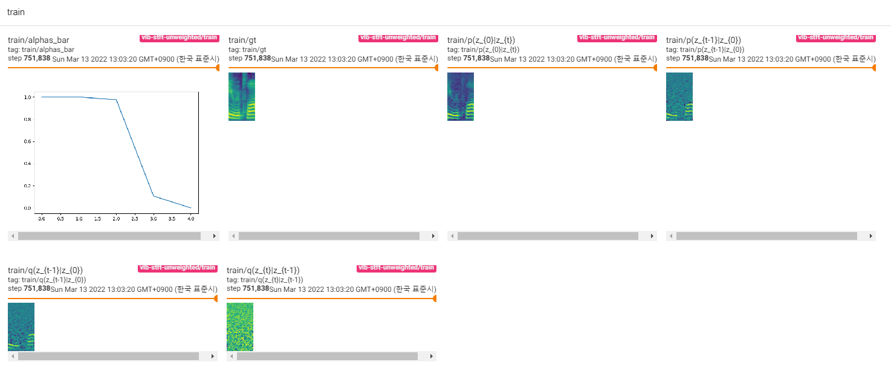

# torch-diffusion-wavegan

Parallel waveform generation with DiffusionGAN

- DiffWave: A Versatile Diffusion Model for Audio Synthesis, Zhifeng Kong et al., 2020. [[arXiv:2009.09761](https://arxiv.org/abs/2009.09761)]
- Tackling the Generative Learning Trilemma with Denoising Diffusion GANs, Xiao et al., 2021. [[2112.07804](https://arxiv.org/abs/2112.07804)]

## Requirements

Tested in python 3.7.9 conda environment.

## Usage

Download LJSpeech dataset from [official:keithito](https://keithito.com/LJ-Speech-Dataset/).

To train model, run [train.py](./train.py)

```bash
python -m utils.dump \
    --data-dir /datasets/LJSpeech-1.1 \
    --output-dir /datasets/LJSpeech-1.1/vocdump \
    --num-proc 8

python train.py \
    --data-dir /datasets/LJSpeech-1.1/vocdump \
    --from-dump
```
To start to train from previous checkpoint, --load-epoch is available.

```bash
python train.py \
    --data-dir /datasets/LJSpeech-1.1/vocdump \
    --from-dump \
    --load-epoch 20 \
    --config ./ckpt/t1.json
```

Checkpoint will be written on TrainConfig.ckpt, tensorboard summary on TrainConfig.log.

```bash
tensorboard --logdir ./log
```

To inference model, run [inference.py](./inference.py)

```bash
python inference.py \
    --config ./ckpt/t1.json \
    --ckpt ./ckpt/t1/t1_200.ckpt \
    --wav /datasets/LJSpeech-1.1/audio/LJ048-0186.wav
```

Pretrained checkpoints are relased on [releases](https://github.com/revsic/torch-diffusion-wavegan/releases).

To use pretrained model, download files and unzip it. Followings are sample script.

```py
from config import Config
from dwg import DiffusionWaveGAN

with open('t1.json') as f:
    config = Config.load(json.load(f))

ckpt = torch.load('t1_200.ckpt', map_location='cpu')

dwg = DiffusionWaveGAN(config.model)
dwg.load(ckpt)
dwg.eval()
```

## Learning curve


## Figures




## Samples

Reference [https://revsic.github.io/torch-diffusion-wavegan](https://revsic.github.io/torch-diffusion-wavegan/)
